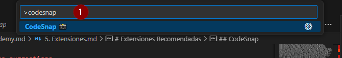
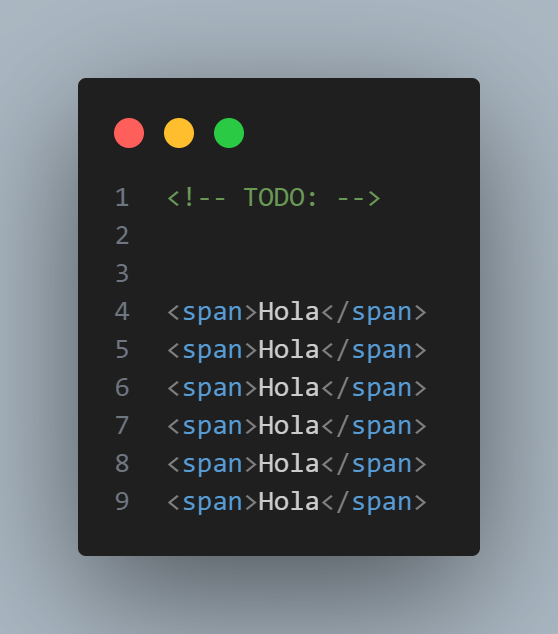
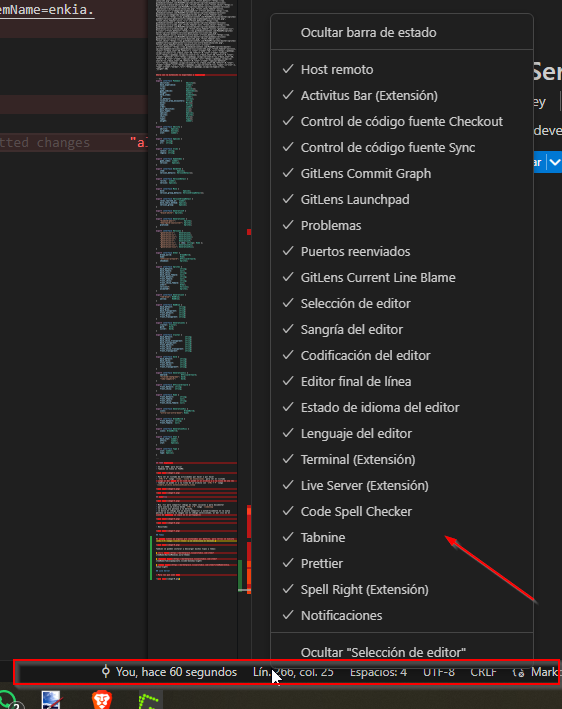
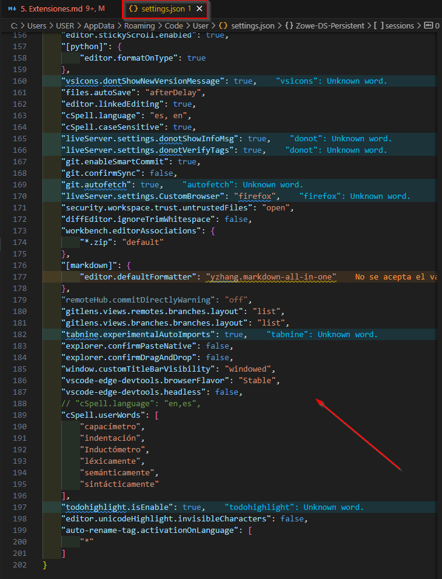

# Introducción

link: https://www.udemy.com/course/vscode-mejora-tu-velocidad-para-codificar/learn/lecture/37589290#overview

## 1. Objetivos

- Usar vscode con el teclado, usando lo menos posible el mouse
- Mejorar la velocidad
- Sacar el máximo provecho a vscode
- Aplicar practicas y tips

## 2. ¿Cómo funciona el curso?

- se divide en secciones, son 6
- se indicaran extensiones que se consideran indispensables y otras que dependen del entorno donde se trabaje
- se recomienda ejecutar el curso respetando cada sección
- se indicará un repositorio para practicar todo lo aprendido
- pueden existir otros métodos para realizar las actividades mas rapido.

## 3. Instalaciones y configuración.

- usando: https://github.com/Klerith/vscode-course
- habilitado en el mismo repo, también se agrega el zip en la carpeta /recursos

## 4. Mis recomendaciones iniciales

- el minimapa arriba a la derecha se puede desactivar, se usa para hacer scroll mas rapido,
    - view-apariencia-minimapa

- **CTRL+P** se puede buscar mayor + "Minimap" (**>minimap**) y desde allí desactivarlo, y desde alli se puede configurar un acceso directo en 2

- la barra lateral izquierda se puede desactivar, y aprenderse los accesos directos a cada boton, **CTRL+P > Activity Bar**
- se recomienda desactivar todo lo que pueda distraer

### Para aumentar tamaño de la vista

- CTRL +  : para aumentar
- CTRL -  : para disminuir

## 5. Extensiones recomendadas

* [Error Lens](https://marketplace.visualstudio.com/items?itemName=usernamehw.errorlens)
    - detecta errores de sintaxis en la linea

* [Material Icon Theme](https://marketplace.visualstudio.com/items?itemName=PKief.material-icon-theme)
    - Para mejorar la parte visual e iconos

* [Activitus Bar](https://marketplace.visualstudio.com/items?itemName=Gruntfuggly.activitusbar)
    - Activa la barra inferior en vscode
    - En mi caso me tocó activarla desde el menu, en: ver-apariencia- barra de estado.
    

* [Auto Rename Tag](https://marketplace.visualstudio.com/items?itemName=formulahendry.auto-rename-tag)
    - se usa cuando se trabaja en la web, para html por ejemplo
    - actualiza las etiquetas mientras se escribe (apertura y cierre)

* [TODO Highlight](https://marketplace.visualstudio.com/items?itemName=wayou.vscode-todo-highlight)
    - sirve para crear marcas por hacer en el codigo, que es muy útil para buscar después, se marca con TODO: y FIXME:

<!-- !* Esto es un comentario TODO:  FIXME: -->

* [Better Comments](https://marketplace.visualstudio.com/items?itemName=aaron-bond.better-comments)

* tema aura theme,
    - Es sencillo

* terminal: para activar un boton acceso directo al terminal, esta obsoleta pero se considera muy util

se activa solo en la barra de estado.

## 6. Sincronizar configuraciones de VSCode

## 7. Configurar el comando "Code"

## 8. ¡Únete a Nuestra Comunidad de DevTalles en Discord!
