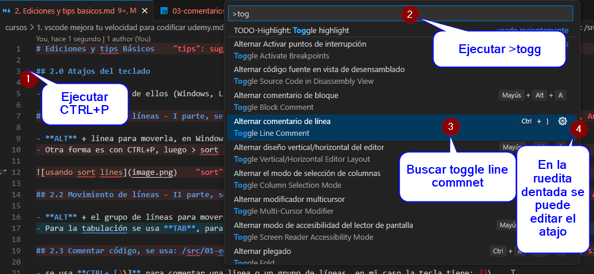

# Ediciones y tips Básicos

## 2.0 Atajos del teclado

- colocados cada uno de ellos (Windows, Linux, Mac) en la carpeta /recursos

## 2.1 Movimiento de líneas - I parte, se usa: /src/01-edicion/01-movimientos.html

- ```ALT + linea``` para moverla, en Windows, se mueve con flecha arriba o flecha abajo
- Otra forma es con ```CTRL+P```, luego ```>sort lines```


## 2.2 Movimiento de líneas - II parte, se usa: /src/01-edicion/02-movimientos.html

- ```ALT + el grupo de líneas``` para moverlas, en Windows,
- Para la tabulación se usa ```TAB```, para la tabulación inversa se usa ```SHIFT+TAB```

## 2.3 Comentar código, se usa: /src/01-edicion/03-comentarios.ts

- Se usa ```CTRL+ [}\]``` para comentar una linea o un grupo de líneas, en mi caso la tecla tiene: ]}\
- Si se quiere ajustar se usa ```CTRL+P``` luego ```>toggle line comment``` y se puede editar allí
- **OJO:** VsCode sabe como comentar, es decir se adapta a cada lenguaje para comentar con los símbolos y forma correcta.



## 2.4 Comentar código y partes de código, se usa:/src/01-edicion/04-comentarios.html

- Para comentar la linea se usa normal: ```Ctrl + \```
- Para comentar solo un pedazo del código se usa ```Shift + Alt + A```
- Para editar el atajo se usa ```CTRL+P``` luego ```>toggle block comment```

## 2.5 Creación rápida de archivos

- Una vez esta en código la ruta de un archivo que aun no se ha creado se puede crear de manera rápida.


## 2.6 Ir y ojear definiciones

- Si encuentro una función, por defecto vscode al enfocar la función dice un resumen de lo que hace, pero si presiono ```CTRL``` encima de la función trae mas información de el código interno.
- Si se da clic entonces se abre el archivo y el lugar donde está la función.


- Con ```ALT + F12``` se puede ver en la misma vista el código de la función, al dividirse la pantalla.


- Con ```CTRL + W``` se cierra la pestaña en la que se está de manera rápida. Y con ```CTRL + SHIFT + T``` se vuelve a abrir la pestaña.

## 2.7 Borrar líneas

- Con ```CTRL + SHIFT + L``` creo un multicursor
- Con ```CTRL + SHIFT + K``` borra la linea, o las líneas

Multicursor:


## 2.8 Deshacer y Rehacer

- Aplica para cualquier programa del sistema,
- Con ```CTRL + Z``` se deshace el ultimo paso,
- Ahora si quiero Rehacer se usa ```CTRL + SHIFT + Z```

## 2.9 Zen mode

- Es un modo sin distracciones, se desactivan todas las distracciones visuales,
- Se usa ```CTRL + K luego Z``` para ingresar y salir

## 2.10 Terminal integrada

- Se usa ```Ctrl + ` ```
- Activa la terminal,
- En mi caso funciona con ```CTRL + ALT + T```
- Permite ejecutar comandos en la terminal de manera rápida sin salir del vscode

## 2.11 Emmet Wrap

- En mi caso el atajo no estaba creado. se ingresaba con ```CTRL + P``` luego se escribe "wrap" y se activa
- Se crea el atajo con: ```ALT + M``` de meter código! :)

## 2.12 Manejo de Chrome tabs

- Para buscar archivos se recomienda con ```CTRL + P``` y buscarlo desde allí
- Para tabular entre las pestañas:
    - ```Ctrl + W```            Cerrar tab
*   - ```Ctrl + K  Ctrl + W```  Cerrar todas
*   - ```Ctrl + Shift + T```    Reabrir anterior
*   - `Ctrl` + `TAB`          Cambiar de tab

## 2.13 Tabulaciones

- Aplica para los sistemas operativos también
- ```TAB``` tabula la indentación
- ```SHIFT TAB```

## 2.14 Creación rápida de carpetas y archivos

1. Si quiero crear un archivo nuevo:
    - Botón derecho en el árbol y crear **Nuevo Archivo**
    - Luego escribir las rutas, al final el nombre del archivo.extensión. 
    - Ejemplo: `directorio_1/directorio_2/archivo.extensión`
    
    

2. Si quiero crear carpetas o subdirectorios:
    - Botón derecho en el árbol y crear **Nueva Carpeta**
    - Luego escribir las rutas, carpetas y subcarpetas, solo se pueden crear subcarpetas, no acepta archivos.extension
    - Ejemplo: `directorio_1/directorio_2/`
