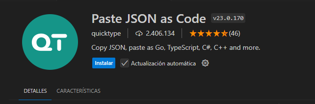

# Ediciones y tips Básicos

## 2.0 Atajos del teclado

- colocados cada uno de ellos (Windows, Linux, Mac) en la carpeta /recursos

## 2.1 Movimiento de líneas - I parte, se usa: /src/01-edicion/01-movimientos.html

- ```ALT + linea``` para moverla, en Windows, se mueve con flecha arriba o flecha abajo
- Otra forma es con ```CTRL+P```, luego ```>sort lines```



## 2.2 Movimiento de líneas - II parte, se usa: /src/01-edicion/02-movimientos.html

- ```ALT + el grupo de líneas``` para moverlas, en Windows,
- Para la tabulación se usa ```TAB```, para la tabulación inversa se usa ```SHIFT+TAB```

## 2.3 Comentar código, se usa: /src/01-edicion/03-comentarios.ts

- Se usa ```CTRL+ [}\]``` para comentar una linea o un grupo de líneas, en mi caso la tecla tiene: ]}\
- Si se quiere ajustar se usa ```CTRL+P``` luego ```>toggle line comment``` y se puede editar allí
- **OJO:** VsCode sabe como comentar, es decir se adapta a cada lenguaje para comentar con los símbolos y forma correcta.


## 2.4 Comentar código y partes de código, se usa:/src/01-edicion/04-comentarios.html

- Para comentar la linea se usa normal: ```Ctrl + \```
- Para comentar solo un pedazo del código se usa ```Shift + Alt + A```
- Para editar el atajo se usa ```CTRL+P``` luego ```>toggle block comment```

## 2.5 Creación rápida de archivos

## 2.6 Ir y ojear definiciones

## 2.7 Borrar líneas

## 2.8 Deshacer y Rehacer

## 2.9 Zen mode

## 2.10 Terminal integrada

## 2.11 Emmet Wrap

## 2.12 Manejo de tabs

## 2.13 Tabulaciones

## 2.14 Creación rápida de carpetas y archivos