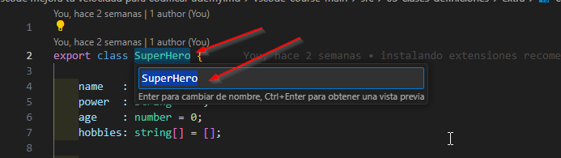
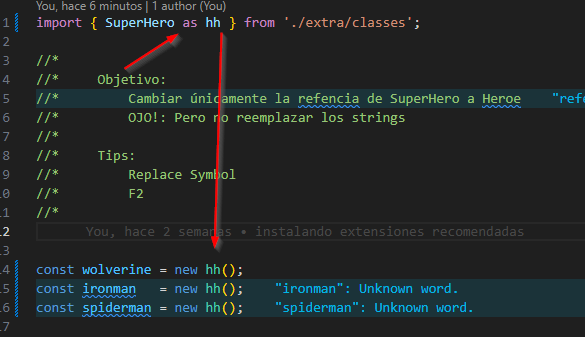
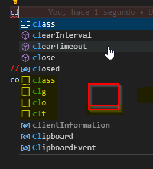
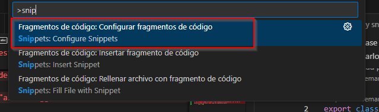
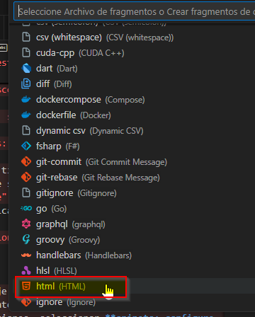

# Definiciones y snippets

## Definiciones en un archivo

- En un archivo de cualquier lenguaje tendrá funciones, constructores etc,
- Para ir rapido a la función, constructor etc. se puede de 2 maneras:
    - `CTRL`+`P` escribir `@` para buscar la definición que se busca
    - `SHIFT`+`CTRL`+`O` y sale automáticamente el **@** para buscar la definición

## Ir a una linea

1. - Con ``CTRL`+`G` salen los 2 puntos para indicar la linea o líneas donde se quiere ir
2. - también con ``CTRL`+`P` luego escribir `:` para ingresar la linea

## Markdown preview

- Se utiliza para hacer un preview a los archivos markdown
- se puede abrir con `CTRL`+`P` escibir markdown y seleccionar abrir vista previa
- en mi caso esta el atajo: `CTRL`+`SHIFT`+`V`

## Reemplazar símbolo

- si por ejemplo tenemos una función o una clase y el nombre quedó mal, se puede corregir parándose en el nombre de la clase o la función y la tecla `F2` aparecerá el nombre debajo que se puede editar, y el vscode se encarga de editarlo en **todas partes** y en __todos los archivos__



si se cambia dentro de un archivo y este depende de una superclase vscode le coloca automáticamente **as** en la definición



## Snippets Básicos

- Dependiendo del lenguaje del archivo vscode tiene predefinidos algunos códigos predefinidos, se reconocen ya que a medida que se escribe los muestra con un icono de rectángulo con linea baja punteada.
- Generan pedazos de código de manera automática



### -**PUEDO CREAR MIS PROPIOS SNIPPETS**

1. Los snippets estan asociados a cada lenguaje de programación, por lo que si necesito crear uno para .html sigo los siguientes pasos:
    - `CTRL`+`P` escribo >snip y salen las opciones, seleccionar **snipets: configure user**
    - luego seleccionar el lenguaje donde se creará el snipper
    - Se abre el archivo con los snippets para ese lenguaje, con un ejemplo de modelo
    - no es necesario reiniciar vscode, se le da el nombre y las características,
    - tambien donde queremos que quede el cursor, acepta multicursores, inclusive que quede algo marcado como recomendación pero listo para ser editado.






Modelo de código snippet:
```json
{
	// Place your snippets for html here. Each snippet is defined under a snippet name and has a prefix, body and 
	// description. The prefix is what is used to trigger the snippet and the body will be expanded and inserted. Possible variables are:
	// $1, $2 for tab stops, $0 for the final cursor position, and ${1:label}, ${2:another} for placeholders. Placeholders with the 
	// same ids are connected.
	// Example:
	// "Print to console": {
	// 	"prefix": "log",
	// 	"body": [
	// 		"console.log('$1');",
	// 		"$2"
	// 	],
	// 	"description": "Log output to console"
	// }
}

// mi ejemplo crear una etiqueta section con un parrafo 
"mensaje luis": {
		"prefix": "luis",
		"body": [
			"<section>Este es el codigo listo mas ${1:recomendado}</section>",
			"$2"
		],
		"description": "de prueba luis"
	}
```

## Tarea snippet

- Crear un snippet para typescript
- el snippet es para una clase:

```ts
class Hero{
	constructor(){
		console.log('Hero initialized');
	}
	showHero(){
		return this;
	}
}
```

Solución:

```json	
"Ejercicio snippet con multicursor y placeholders": {
		"prefix": "ejercicio",
		"body": [
			"class ${1:Hero} {",
			"	constructor() {",
			"		console.log('${1:Hero} initialized');",
			"	}",
			"	show${1:Hero}() {",
			"		return this;",
			"	}",
			"}",
			"$2"
		],
		"description": "Ejercicio snippet con multicursor y placeholders"
	}
```