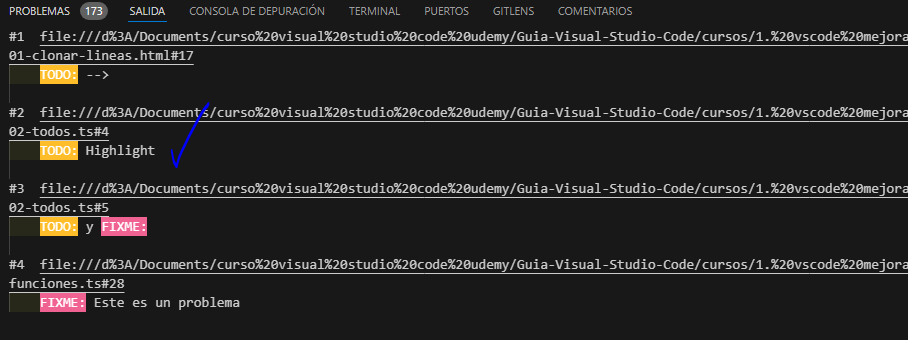
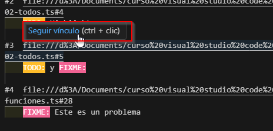
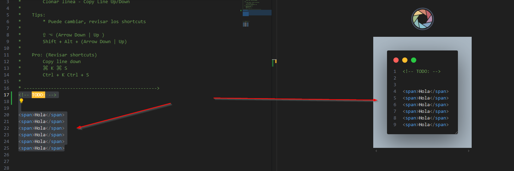

# Extensiones Recomendadas

## 1. Paste JSON as Code

- si se tiene un código JSON
- se puede crear la interface con esta extensión
- se puede apoyar en el sitio web quicktype https://quicktype.io/
- el sitio web es mas poderoso que la extensión
- el resultado de la extensión no siempre es perfecta, se debe revisar pero por lo general solo se necesitan ajustes pequeños al final
- el código JSON se copia en el portapapeles
- luego con `CTRL`+ `P` se busca `>paste..` y se ejecuta


Ejemplo: 1 datos en json

```json
{"abilities":[{"ability":{"name":"limber","url":"https://pokeapi.co/api/v2/ability/7/"},"is_hidden":false,"slot":1},{"ability":{"name":"imposter","url":"https://pokeapi.co/api/v2/ability/150/"},"is_hidden":true,"slot":3}],"base_experience":101,"cries":{"latest":"https://raw.githubusercontent.com/PokeAPI/cries/main/cries/pokemon/latest/132.ogg","legacy":"https://raw.githubusercontent.com/PokeAPI/cries/main/cries/pokemon/legacy/132.ogg"},"forms":[{"name":"ditto","url":"https://pokeapi.co/api/v2/pokemon-form/132/"}],"game_indices":[{"game_index":76,"version":{"name":"red","url":"https://pokeapi.co/api/v2/version/1/"}},{"game_index":76,"version":{"name":"blue","url":"https://pokeapi.co/api/v2/version/2/"}},{"game_index":76,"version":{"name":"yellow","url":"https://pokeapi.co/api/v2/version/3/"}},{"game_index":132,"version":{"name":"gold","url":"https://pokeapi.co/api/v2/version/4/"}},{"game_index":132,"version":{"name":"silver","url":"https://pokeapi.co/api/v2/version/5/"}},{"game_index":132,"version":{"name":"crystal","url":"https://pokeapi.co/api/v2/version/6/"}},{"game_index":132,"version":{"name":"ruby","url":"https://pokeapi.co/api/v2/version/7/"}},{"game_index":132,"version":{"name":"sapphire","url":"https://pokeapi.co/api/v2/version/8/"}},{"game_index":132,"version":{"name":"emerald","url":"https://pokeapi.co/api/v2/version/9/"}},{"game_index":132,"version":{"name":"firered","url":"https://pokeapi.co/api/v2/version/10/"}},{"game_index":132,"version":{"name":"leafgreen","url":"https://pokeapi.co/api/v2/version/11/"}},{"game_index":132,"version":{"name":"diamond","url":"https://pokeapi.co/api/v2/version/12/"}},{"game_index":132,"version":{"name":"pearl","url":"https://pokeapi.co/api/v2/version/13/"}},{"game_index":132,"version":{"name":"platinum","url":"https://pokeapi.co/api/v2/version/14/"}},{"game_index":132,"version":{"name":"heartgold","url":"https://pokeapi.co/api/v2/version/15/"}},{"game_index":132,"version":{"name":"soulsilver","url":"https://pokeapi.co/api/v2/version/16/"}},{"game_index":132,"version":{"name":"black","url":"https://pokeapi.co/api/v2/version/17/"}},{"game_index":132,"version":{"name":"white","url":"https://pokeapi.co/api/v2/version/18/"}},{"game_index":132,"version":{"name":"black-2","url":"https://pokeapi.co/api/v2/version/21/"}},{"game_index":132,"version":{"name":"white-2","url":"https://pokeapi.co/api/v2/version/22/"}}],"height":3,"held_items":[{"item":{"name":"metal-powder","url":"https://pokeapi.co/api/v2/item/234/"},"version_details":[{"rarity":5,"version":{"name":"ruby","url":"https://pokeapi.co/api/v2/version/7/"}},{"rarity":5,"version":{"name":"sapphire","url":"https://pokeapi.co/api/v2/version/8/"}},{"rarity":5,"version":{"name":"emerald","url":"https://pokeapi.co/api/v2/version/9/"}},{"rarity":5,"version":{"name":"firered","url":"https://pokeapi.co/api/v2/version/10/"}},{"rarity":5,"version":{"name":"leafgreen","url":"https://pokeapi.co/api/v2/version/11/"}},{"rarity":5,"version":{"name":"diamond","url":"https://pokeapi.co/api/v2/version/12/"}},{"rarity":5,"version":{"name":"pearl","url":"https://pokeapi.co/api/v2/version/13/"}},{"rarity":5,"version":{"name":"platinum","url":"https://pokeapi.co/api/v2/version/14/"}},{"rarity":5,"version":{"name":"heartgold","url":"https://pokeapi.co/api/v2/version/15/"}},{"rarity":5,"version":{"name":"soulsilver","url":"https://pokeapi.co/api/v2/version/16/"}},{"rarity":5,"version":{"name":"black","url":"https://pokeapi.co/api/v2/version/17/"}},{"rarity":5,"version":{"name":"white","url":"https://pokeapi.co/api/v2/version/18/"}},{"rarity":5,"version":{"name":"black-2","url":"https://pokeapi.co/api/v2/version/21/"}},{"rarity":5,"version":{"name":"white-2","url":"https://pokeapi.co/api/v2/version/22/"}},{"rarity":5,"version":{"name":"x","url":"https://pokeapi.co/api/v2/version/23/"}},{"rarity":5,"version":{"name":"y","url":"https://pokeapi.co/api/v2/version/24/"}},{"rarity":5,"version":{"name":"omega-ruby","url":"https://pokeapi.co/api/v2/version/25/"}},{"rarity":5,"version":{"name":"alpha-sapphire","url":"https://pokeapi.co/api/v2/version/26/"}},{"rarity":5,"version":{"name":"sun","url":"https://pokeapi.co/api/v2/version/27/"}},{"rarity":5,"version":{"name":"moon","url":"https://pokeapi.co/api/v2/version/28/"}},{"rarity":5,"version":{"name":"ultra-sun","url":"https://pokeapi.co/api/v2/version/29/"}},{"rarity":5,"version":{"name":"ultra-moon","url":"https://pokeapi.co/api/v2/version/30/"}}]},{"item":{"name":"quick-powder","url":"https://pokeapi.co/api/v2/item/251/"},"version_details":[{"rarity":50,"version":{"name":"diamond","url":"https://pokeapi.co/api/v2/version/12/"}},{"rarity":50,"version":{"name":"pearl","url":"https://pokeapi.co/api/v2/version/13/"}},{"rarity":50,"version":{"name":"platinum","url":"https://pokeapi.co/api/v2/version/14/"}},{"rarity":50,"version":{"name":"heartgold","url":"https://pokeapi.co/api/v2/version/15/"}},{"rarity":50,"version":{"name":"soulsilver","url":"https://pokeapi.co/api/v2/version/16/"}},{"rarity":50,"version":{"name":"black","url":"https://pokeapi.co/api/v2/version/17/"}},{"rarity":50,"version":{"name":"white","url":"https://pokeapi.co/api/v2/version/18/"}},{"rarity":50,"version":{"name":"black-2","url":"https://pokeapi.co/api/v2/version/21/"}},{"rarity":50,"version":{"name":"white-2","url":"https://pokeapi.co/api/v2/version/22/"}},{"rarity":50,"version":{"name":"x","url":"https://pokeapi.co/api/v2/version/23/"}},{"rarity":50,"version":{"name":"y","url":"https://pokeapi.co/api/v2/version/24/"}},{"rarity":50,"version":{"name":"omega-ruby","url":"https://pokeapi.co/api/v2/version/25/"}},{"rarity":50,"version":{"name":"alpha-sapphire","url":"https://pokeapi.co/api/v2/version/26/"}},{"rarity":50,"version":{"name":"sun","url":"https://pokeapi.co/api/v2/version/27/"}},{"rarity":50,"version":{"name":"moon","url":"https://pokeapi.co/api/v2/version/28/"}},{"rarity":50,"version":{"name":"ultra-sun","url":"https://pokeapi.co/api/v2/version/29/"}},{"rarity":50,"version":{"name":"ultra-moon","url":"https://pokeapi.co/api/v2/version/30/"}}]}],"id":132,"is_default":true,"location_area_encounters":"https://pokeapi.co/api/v2/pokemon/132/encounters","moves":[{"move":{"name":"transform","url":"https://pokeapi.co/api/v2/move/144/"},"version_group_details":[{"level_learned_at":1,"move_learn_method":{"name":"level-up","url":"https://pokeapi.co/api/v2/move-learn-method/1/"},"version_group":{"name":"red-blue","url":"https://pokeapi.co/api/v2/version-group/1/"}},{"level_learned_at":1,"move_learn_method":{"name":"level-up","url":"https://pokeapi.co/api/v2/move-learn-method/1/"},"version_group":{"name":"yellow","url":"https://pokeapi.co/api/v2/version-group/2/"}},{"level_learned_at":1,"move_learn_method":{"name":"level-up","url":"https://pokeapi.co/api/v2/move-learn-method/1/"},"version_group":{"name":"gold-silver","url":"https://pokeapi.co/api/v2/version-group/3/"}},{"level_learned_at":1,"move_learn_method":{"name":"level-up","url":"https://pokeapi.co/api/v2/move-learn-method/1/"},"version_group":{"name":"crystal","url":"https://pokeapi.co/api/v2/version-group/4/"}},{"level_learned_at":1,"move_learn_method":{"name":"level-up","url":"https://pokeapi.co/api/v2/move-learn-method/1/"},"version_group":{"name":"ruby-sapphire","url":"https://pokeapi.co/api/v2/version-group/5/"}},{"level_learned_at":1,"move_learn_method":{"name":"level-up","url":"https://pokeapi.co/api/v2/move-learn-method/1/"},"version_group":{"name":"emerald","url":"https://pokeapi.co/api/v2/version-group/6/"}},{"level_learned_at":1,"move_learn_method":{"name":"level-up","url":"https://pokeapi.co/api/v2/move-learn-method/1/"},"version_group":{"name":"firered-leafgreen","url":"https://pokeapi.co/api/v2/version-group/7/"}},{"level_learned_at":1,"move_learn_method":{"name":"level-up","url":"https://pokeapi.co/api/v2/move-learn-method/1/"},"version_group":{"name":"diamond-pearl","url":"https://pokeapi.co/api/v2/version-group/8/"}},{"level_learned_at":1,"move_learn_method":{"name":"level-up","url":"https://pokeapi.co/api/v2/move-learn-method/1/"},"version_group":{"name":"platinum","url":"https://pokeapi.co/api/v2/version-group/9/"}},{"level_learned_at":1,"move_learn_method":{"name":"level-up","url":"https://pokeapi.co/api/v2/move-learn-method/1/"},"version_group":{"name":"heartgold-soulsilver","url":"https://pokeapi.co/api/v2/version-group/10/"}},{"level_learned_at":1,"move_learn_method":{"name":"level-up","url":"https://pokeapi.co/api/v2/move-learn-method/1/"},"version_group":{"name":"black-white","url":"https://pokeapi.co/api/v2/version-group/11/"}},{"level_learned_at":1,"move_learn_method":{"name":"level-up","url":"https://pokeapi.co/api/v2/move-learn-method/1/"},"version_group":{"name":"colosseum","url":"https://pokeapi.co/api/v2/version-group/12/"}},{"level_learned_at":1,"move_learn_method":{"name":"level-up","url":"https://pokeapi.co/api/v2/move-learn-method/1/"},"version_group":{"name":"xd","url":"https://pokeapi.co/api/v2/version-group/13/"}},{"level_learned_at":1,"move_learn_method":{"name":"level-up","url":"https://pokeapi.co/api/v2/move-learn-method/1/"},"version_group":{"name":"black-2-white-2","url":"https://pokeapi.co/api/v2/version-group/14/"}},{"level_learned_at":1,"move_learn_method":{"name":"level-up","url":"https://pokeapi.co/api/v2/move-learn-method/1/"},"version_group":{"name":"x-y","url":"https://pokeapi.co/api/v2/version-group/15/"}},{"level_learned_at":1,"move_learn_method":{"name":"level-up","url":"https://pokeapi.co/api/v2/move-learn-method/1/"},"version_group":{"name":"omega-ruby-alpha-sapphire","url":"https://pokeapi.co/api/v2/version-group/16/"}},{"level_learned_at":1,"move_learn_method":{"name":"level-up","url":"https://pokeapi.co/api/v2/move-learn-method/1/"},"version_group":{"name":"sun-moon","url":"https://pokeapi.co/api/v2/version-group/17/"}},{"level_learned_at":1,"move_learn_method":{"name":"level-up","url":"https://pokeapi.co/api/v2/move-learn-method/1/"},"version_group":{"name":"ultra-sun-ultra-moon","url":"https://pokeapi.co/api/v2/version-group/18/"}},{"level_learned_at":1,"move_learn_method":{"name":"level-up","url":"https://pokeapi.co/api/v2/move-learn-method/1/"},"version_group":{"name":"lets-go-pikachu-lets-go-eevee","url":"https://pokeapi.co/api/v2/version-group/19/"}},{"level_learned_at":1,"move_learn_method":{"name":"level-up","url":"https://pokeapi.co/api/v2/move-learn-method/1/"},"version_group":{"name":"sword-shield","url":"https://pokeapi.co/api/v2/version-group/20/"}},{"level_learned_at":1,"move_learn_method":{"name":"level-up","url":"https://pokeapi.co/api/v2/move-learn-method/1/"},"version_group":{"name":"brilliant-diamond-and-shining-pearl","url":"https://pokeapi.co/api/v2/version-group/23/"}},{"level_learned_at":1,"move_learn_method":{"name":"level-up","url":"https://pokeapi.co/api/v2/move-learn-method/1/"},"version_group":{"name":"scarlet-violet","url":"https://pokeapi.co/api/v2/version-group/25/"}}]}],"name":"ditto","order":214,"past_abilities":[],"past_types":[],"species":{"name":"ditto","url":"https://pokeapi.co/api/v2/pokemon-species/132/"},"sprites":{"back_default":"https://raw.githubusercontent.com/PokeAPI/sprites/master/sprites/pokemon/back/132.png","back_female":null,"back_shiny":"https://raw.githubusercontent.com/PokeAPI/sprites/master/sprites/pokemon/back/shiny/132.png","back_shiny_female":null,"front_default":"https://raw.githubusercontent.com/PokeAPI/sprites/master/sprites/pokemon/132.png","front_female":null,"front_shiny":"https://raw.githubusercontent.com/PokeAPI/sprites/master/sprites/pokemon/shiny/132.png","front_shiny_female":null,"other":{"dream_world":{"front_default":"https://raw.githubusercontent.com/PokeAPI/sprites/master/sprites/pokemon/other/dream-world/132.svg","front_female":null},"home":{"front_default":"https://raw.githubusercontent.com/PokeAPI/sprites/master/sprites/pokemon/other/home/132.png","front_female":null,"front_shiny":"https://raw.githubusercontent.com/PokeAPI/sprites/master/sprites/pokemon/other/home/shiny/132.png","front_shiny_female":null},"official-artwork":{"front_default":"https://raw.githubusercontent.com/PokeAPI/sprites/master/sprites/pokemon/other/official-artwork/132.png","front_shiny":"https://raw.githubusercontent.com/PokeAPI/sprites/master/sprites/pokemon/other/official-artwork/shiny/132.png"},"showdown":{"back_default":"https://raw.githubusercontent.com/PokeAPI/sprites/master/sprites/pokemon/other/showdown/back/132.gif","back_female":null,"back_shiny":"https://raw.githubusercontent.com/PokeAPI/sprites/master/sprites/pokemon/other/showdown/back/shiny/132.gif","back_shiny_female":null,"front_default":"https://raw.githubusercontent.com/PokeAPI/sprites/master/sprites/pokemon/other/showdown/132.gif","front_female":null,"front_shiny":"https://raw.githubusercontent.com/PokeAPI/sprites/master/sprites/pokemon/other/showdown/shiny/132.gif","front_shiny_female":null}},"versions":{"generation-i":{"red-blue":{"back_default":"https://raw.githubusercontent.com/PokeAPI/sprites/master/sprites/pokemon/versions/generation-i/red-blue/back/132.png","back_gray":"https://raw.githubusercontent.com/PokeAPI/sprites/master/sprites/pokemon/versions/generation-i/red-blue/back/gray/132.png","back_transparent":"https://raw.githubusercontent.com/PokeAPI/sprites/master/sprites/pokemon/versions/generation-i/red-blue/transparent/back/132.png","front_default":"https://raw.githubusercontent.com/PokeAPI/sprites/master/sprites/pokemon/versions/generation-i/red-blue/132.png","front_gray":"https://raw.githubusercontent.com/PokeAPI/sprites/master/sprites/pokemon/versions/generation-i/red-blue/gray/132.png","front_transparent":"https://raw.githubusercontent.com/PokeAPI/sprites/master/sprites/pokemon/versions/generation-i/red-blue/transparent/132.png"},"yellow":{"back_default":"https://raw.githubusercontent.com/PokeAPI/sprites/master/sprites/pokemon/versions/generation-i/yellow/back/132.png","back_gray":"https://raw.githubusercontent.com/PokeAPI/sprites/master/sprites/pokemon/versions/generation-i/yellow/back/gray/132.png","back_transparent":"https://raw.githubusercontent.com/PokeAPI/sprites/master/sprites/pokemon/versions/generation-i/yellow/transparent/back/132.png","front_default":"https://raw.githubusercontent.com/PokeAPI/sprites/master/sprites/pokemon/versions/generation-i/yellow/132.png","front_gray":"https://raw.githubusercontent.com/PokeAPI/sprites/master/sprites/pokemon/versions/generation-i/yellow/gray/132.png","front_transparent":"https://raw.githubusercontent.com/PokeAPI/sprites/master/sprites/pokemon/versions/generation-i/yellow/transparent/132.png"}},"generation-ii":{"crystal":{"back_default":"https://raw.githubusercontent.com/PokeAPI/sprites/master/sprites/pokemon/versions/generation-ii/crystal/back/132.png","back_shiny":"https://raw.githubusercontent.com/PokeAPI/sprites/master/sprites/pokemon/versions/generation-ii/crystal/back/shiny/132.png","back_shiny_transparent":"https://raw.githubusercontent.com/PokeAPI/sprites/master/sprites/pokemon/versions/generation-ii/crystal/transparent/back/shiny/132.png","back_transparent":"https://raw.githubusercontent.com/PokeAPI/sprites/master/sprites/pokemon/versions/generation-ii/crystal/transparent/back/132.png","front_default":"https://raw.githubusercontent.com/PokeAPI/sprites/master/sprites/pokemon/versions/generation-ii/crystal/132.png","front_shiny":"https://raw.githubusercontent.com/PokeAPI/sprites/master/sprites/pokemon/versions/generation-ii/crystal/shiny/132.png","front_shiny_transparent":"https://raw.githubusercontent.com/PokeAPI/sprites/master/sprites/pokemon/versions/generation-ii/crystal/transparent/shiny/132.png","front_transparent":"https://raw.githubusercontent.com/PokeAPI/sprites/master/sprites/pokemon/versions/generation-ii/crystal/transparent/132.png"},"gold":{"back_default":"https://raw.githubusercontent.com/PokeAPI/sprites/master/sprites/pokemon/versions/generation-ii/gold/back/132.png","back_shiny":"https://raw.githubusercontent.com/PokeAPI/sprites/master/sprites/pokemon/versions/generation-ii/gold/back/shiny/132.png","front_default":"https://raw.githubusercontent.com/PokeAPI/sprites/master/sprites/pokemon/versions/generation-ii/gold/132.png","front_shiny":"https://raw.githubusercontent.com/PokeAPI/sprites/master/sprites/pokemon/versions/generation-ii/gold/shiny/132.png","front_transparent":"https://raw.githubusercontent.com/PokeAPI/sprites/master/sprites/pokemon/versions/generation-ii/gold/transparent/132.png"},"silver":{"back_default":"https://raw.githubusercontent.com/PokeAPI/sprites/master/sprites/pokemon/versions/generation-ii/silver/back/132.png","back_shiny":"https://raw.githubusercontent.com/PokeAPI/sprites/master/sprites/pokemon/versions/generation-ii/silver/back/shiny/132.png","front_default":"https://raw.githubusercontent.com/PokeAPI/sprites/master/sprites/pokemon/versions/generation-ii/silver/132.png","front_shiny":"https://raw.githubusercontent.com/PokeAPI/sprites/master/sprites/pokemon/versions/generation-ii/silver/shiny/132.png","front_transparent":"https://raw.githubusercontent.com/PokeAPI/sprites/master/sprites/pokemon/versions/generation-ii/silver/transparent/132.png"}},"generation-iii":{"emerald":{"front_default":"https://raw.githubusercontent.com/PokeAPI/sprites/master/sprites/pokemon/versions/generation-iii/emerald/132.png","front_shiny":"https://raw.githubusercontent.com/PokeAPI/sprites/master/sprites/pokemon/versions/generation-iii/emerald/shiny/132.png"},"firered-leafgreen":{"back_default":"https://raw.githubusercontent.com/PokeAPI/sprites/master/sprites/pokemon/versions/generation-iii/firered-leafgreen/back/132.png","back_shiny":"https://raw.githubusercontent.com/PokeAPI/sprites/master/sprites/pokemon/versions/generation-iii/firered-leafgreen/back/shiny/132.png","front_default":"https://raw.githubusercontent.com/PokeAPI/sprites/master/sprites/pokemon/versions/generation-iii/firered-leafgreen/132.png","front_shiny":"https://raw.githubusercontent.com/PokeAPI/sprites/master/sprites/pokemon/versions/generation-iii/firered-leafgreen/shiny/132.png"},"ruby-sapphire":{"back_default":"https://raw.githubusercontent.com/PokeAPI/sprites/master/sprites/pokemon/versions/generation-iii/ruby-sapphire/back/132.png","back_shiny":"https://raw.githubusercontent.com/PokeAPI/sprites/master/sprites/pokemon/versions/generation-iii/ruby-sapphire/back/shiny/132.png","front_default":"https://raw.githubusercontent.com/PokeAPI/sprites/master/sprites/pokemon/versions/generation-iii/ruby-sapphire/132.png","front_shiny":"https://raw.githubusercontent.com/PokeAPI/sprites/master/sprites/pokemon/versions/generation-iii/ruby-sapphire/shiny/132.png"}},"generation-iv":{"diamond-pearl":{"back_default":"https://raw.githubusercontent.com/PokeAPI/sprites/master/sprites/pokemon/versions/generation-iv/diamond-pearl/back/132.png","back_female":null,"back_shiny":"https://raw.githubusercontent.com/PokeAPI/sprites/master/sprites/pokemon/versions/generation-iv/diamond-pearl/back/shiny/132.png","back_shiny_female":null,"front_default":"https://raw.githubusercontent.com/PokeAPI/sprites/master/sprites/pokemon/versions/generation-iv/diamond-pearl/132.png","front_female":null,"front_shiny":"https://raw.githubusercontent.com/PokeAPI/sprites/master/sprites/pokemon/versions/generation-iv/diamond-pearl/shiny/132.png","front_shiny_female":null},"heartgold-soulsilver":{"back_default":"https://raw.githubusercontent.com/PokeAPI/sprites/master/sprites/pokemon/versions/generation-iv/heartgold-soulsilver/back/132.png","back_female":null,"back_shiny":"https://raw.githubusercontent.com/PokeAPI/sprites/master/sprites/pokemon/versions/generation-iv/heartgold-soulsilver/back/shiny/132.png","back_shiny_female":null,"front_default":"https://raw.githubusercontent.com/PokeAPI/sprites/master/sprites/pokemon/versions/generation-iv/heartgold-soulsilver/132.png","front_female":null,"front_shiny":"https://raw.githubusercontent.com/PokeAPI/sprites/master/sprites/pokemon/versions/generation-iv/heartgold-soulsilver/shiny/132.png","front_shiny_female":null},"platinum":{"back_default":"https://raw.githubusercontent.com/PokeAPI/sprites/master/sprites/pokemon/versions/generation-iv/platinum/back/132.png","back_female":null,"back_shiny":"https://raw.githubusercontent.com/PokeAPI/sprites/master/sprites/pokemon/versions/generation-iv/platinum/back/shiny/132.png","back_shiny_female":null,"front_default":"https://raw.githubusercontent.com/PokeAPI/sprites/master/sprites/pokemon/versions/generation-iv/platinum/132.png","front_female":null,"front_shiny":"https://raw.githubusercontent.com/PokeAPI/sprites/master/sprites/pokemon/versions/generation-iv/platinum/shiny/132.png","front_shiny_female":null}},"generation-v":{"black-white":{"animated":{"back_default":"https://raw.githubusercontent.com/PokeAPI/sprites/master/sprites/pokemon/versions/generation-v/black-white/animated/back/132.gif","back_female":null,"back_shiny":"https://raw.githubusercontent.com/PokeAPI/sprites/master/sprites/pokemon/versions/generation-v/black-white/animated/back/shiny/132.gif","back_shiny_female":null,"front_default":"https://raw.githubusercontent.com/PokeAPI/sprites/master/sprites/pokemon/versions/generation-v/black-white/animated/132.gif","front_female":null,"front_shiny":"https://raw.githubusercontent.com/PokeAPI/sprites/master/sprites/pokemon/versions/generation-v/black-white/animated/shiny/132.gif","front_shiny_female":null},"back_default":"https://raw.githubusercontent.com/PokeAPI/sprites/master/sprites/pokemon/versions/generation-v/black-white/back/132.png","back_female":null,"back_shiny":"https://raw.githubusercontent.com/PokeAPI/sprites/master/sprites/pokemon/versions/generation-v/black-white/back/shiny/132.png","back_shiny_female":null,"front_default":"https://raw.githubusercontent.com/PokeAPI/sprites/master/sprites/pokemon/versions/generation-v/black-white/132.png","front_female":null,"front_shiny":"https://raw.githubusercontent.com/PokeAPI/sprites/master/sprites/pokemon/versions/generation-v/black-white/shiny/132.png","front_shiny_female":null}},"generation-vi":{"omegaruby-alphasapphire":{"front_default":"https://raw.githubusercontent.com/PokeAPI/sprites/master/sprites/pokemon/versions/generation-vi/omegaruby-alphasapphire/132.png","front_female":null,"front_shiny":"https://raw.githubusercontent.com/PokeAPI/sprites/master/sprites/pokemon/versions/generation-vi/omegaruby-alphasapphire/shiny/132.png","front_shiny_female":null},"x-y":{"front_default":"https://raw.githubusercontent.com/PokeAPI/sprites/master/sprites/pokemon/versions/generation-vi/x-y/132.png","front_female":null,"front_shiny":"https://raw.githubusercontent.com/PokeAPI/sprites/master/sprites/pokemon/versions/generation-vi/x-y/shiny/132.png","front_shiny_female":null}},"generation-vii":{"icons":{"front_default":"https://raw.githubusercontent.com/PokeAPI/sprites/master/sprites/pokemon/versions/generation-vii/icons/132.png","front_female":null},"ultra-sun-ultra-moon":{"front_default":"https://raw.githubusercontent.com/PokeAPI/sprites/master/sprites/pokemon/versions/generation-vii/ultra-sun-ultra-moon/132.png","front_female":null,"front_shiny":"https://raw.githubusercontent.com/PokeAPI/sprites/master/sprites/pokemon/versions/generation-vii/ultra-sun-ultra-moon/shiny/132.png","front_shiny_female":null}},"generation-viii":{"icons":{"front_default":"https://raw.githubusercontent.com/PokeAPI/sprites/master/sprites/pokemon/versions/generation-viii/icons/132.png","front_female":null}}}},"stats":[{"base_stat":48,"effort":1,"stat":{"name":"hp","url":"https://pokeapi.co/api/v2/stat/1/"}},{"base_stat":48,"effort":0,"stat":{"name":"attack","url":"https://pokeapi.co/api/v2/stat/2/"}},{"base_stat":48,"effort":0,"stat":{"name":"defense","url":"https://pokeapi.co/api/v2/stat/3/"}},{"base_stat":48,"effort":0,"stat":{"name":"special-attack","url":"https://pokeapi.co/api/v2/stat/4/"}},{"base_stat":48,"effort":0,"stat":{"name":"special-defense","url":"https://pokeapi.co/api/v2/stat/5/"}},{"base_stat":48,"effort":0,"stat":{"name":"speed","url":"https://pokeapi.co/api/v2/stat/6/"}}],"types":[{"slot":1,"type":{"name":"normal","url":"https://pokeapi.co/api/v2/type/1/"}}],"weight":40}
```

Ahora con la extensión lo exportamos a typescript

```ts
export interface Pokemon {
    abilities:                Ability[];
    base_experience:          number;
    cries:                    Cries;
    forms:                    Species[];
    game_indices:             GameIndex[];
    height:                   number;
    held_items:               HeldItem[];
    id:                       number;
    is_default:               boolean;
    location_area_encounters: string;
    moves:                    Move[];
    name:                     string;
    order:                    number;
    past_abilities:           any[];
    past_types:               any[];
    species:                  Species;
    sprites:                  Sprites;
    stats:                    Stat[];
    types:                    Type[];
    weight:                   number;
}

export interface Ability {
    ability:   Species;
    is_hidden: boolean;
    slot:      number;
}

export interface Species {
    name: string;
    url:  string;
}

export interface Cries {
    latest: string;
    legacy: string;
}

export interface GameIndex {
    game_index: number;
    version:    Species;
}

export interface HeldItem {
    item:            Species;
    version_details: VersionDetail[];
}

export interface VersionDetail {
    rarity:  number;
    version: Species;
}

export interface Move {
    move:                  Species;
    version_group_details: VersionGroupDetail[];
}

export interface VersionGroupDetail {
    level_learned_at:  number;
    move_learn_method: Species;
    version_group:     Species;
}

export interface GenerationV {
    "black-white": Sprites;
}

export interface GenerationIv {
    "diamond-pearl":        Sprites;
    "heartgold-soulsilver": Sprites;
    platinum:               Sprites;
}

export interface Versions {
    "generation-i":    GenerationI;
    "generation-ii":   GenerationIi;
    "generation-iii":  GenerationIii;
    "generation-iv":   GenerationIv;
    "generation-v":    GenerationV;
    "generation-vi":   { [key: string]: Home };
    "generation-vii":  GenerationVii;
    "generation-viii": GenerationViii;
}

export interface Other {
    dream_world:        DreamWorld;
    home:               Home;
    "official-artwork": OfficialArtwork;
    showdown:           Sprites;
}

export interface Sprites {
    back_default:       string;
    back_female:        null;
    back_shiny:         string;
    back_shiny_female:  null;
    front_default:      string;
    front_female:       null;
    front_shiny:        string;
    front_shiny_female: null;
    other?:             Other;
    versions?:          Versions;
    animated?:          Sprites;
}

export interface GenerationI {
    "red-blue": RedBlue;
    yellow:     RedBlue;
}

export interface RedBlue {
    back_default:      string;
    back_gray:         string;
    back_transparent:  string;
    front_default:     string;
    front_gray:        string;
    front_transparent: string;
}

export interface GenerationIi {
    crystal: Crystal;
    gold:    Gold;
    silver:  Gold;
}

export interface Crystal {
    back_default:            string;
    back_shiny:              string;
    back_shiny_transparent:  string;
    back_transparent:        string;
    front_default:           string;
    front_shiny:             string;
    front_shiny_transparent: string;
    front_transparent:       string;
}

export interface Gold {
    back_default:       string;
    back_shiny:         string;
    front_default:      string;
    front_shiny:        string;
    front_transparent?: string;
}

export interface GenerationIii {
    emerald:             OfficialArtwork;
    "firered-leafgreen": Gold;
    "ruby-sapphire":     Gold;
}

export interface OfficialArtwork {
    front_default: string;
    front_shiny:   string;
}

export interface Home {
    front_default:      string;
    front_female:       null;
    front_shiny:        string;
    front_shiny_female: null;
}

export interface GenerationVii {
    icons:                  DreamWorld;
    "ultra-sun-ultra-moon": Home;
}

export interface DreamWorld {
    front_default: string;
    front_female:  null;
}

export interface GenerationViii {
    icons: DreamWorld;
}

export interface Stat {
    base_stat: number;
    effort:    number;
    stat:      Species;
}

export interface Type {
    slot: number;
    type: Species;
}

```

## TODO Highlight

- Se usa TODO: para marcar
- Tambien se tiene el FIXME:


- Para ver el listado de actividades por hacer o por hacer
- `CTRL`+`P` luego `>todo.. lista de anotaciones` para ver el listado
- Luego al dar click en el link se puede ir al archivo y a la linea de una vez
- tambien se puede ir a la linea de un archivo con `CTRL`+`P` luego `>nombre_archivo.extension#numero_linea`





## CodeSnap


- Muy útil para compartir código en redes sociales o para documentar
- para usarla se activa desde `CTRL`+`P` luego `>codesnap`
- se activa una pestaña a la derecha,
- se marca el código que se quiera compartir y automáticamente en la nueva pestaña se muestra la imagen con el código seleccionado, al dar clic en el icono de codesnap se copia en el portapapeles




- Resultado:


## Temas

En vscode vienen ya algunos pre instalados por defecto, para verlos se ejecuta `CTRL`+`P` luego `>color theme` y se selecciona el deseado, 


Tambien se pueden instalar y descargar muchos tipos y temas:

* [Aura Theme](https://marketplace.visualstudio.com/items?itemName=DaltonMenezes.aura-theme)

* [Monokai Night](https://marketplace.visualstudio.com/items?itemName=fabiospampinato.vscode-monokai-night)

* [Tokyo night](https://marketplace.visualstudio.com/items?itemName=enkia.tokyo-night)

## Live Server

- Para los que usen html


La barra inferior informativa es posible editar que muestra, dando `CLICK derecho` y aparecen las opciones que se pueden habilitar


## color Highlight


- Es opcional
- Se puede configurar la forma de verse los colores, ingresando a `CTRL`+`P` luego `>settings UI`, luego buscar la extensión y hacer alli los ajustes

## Settings JSON - Archivo de configuración

- Guarda las configuraciones que no son por defecto, es decir las que nosotros configuremos.
- Si hay sincronización activa entonces tambien se sincronizan estos cambios.
- Se pueden crear temas personalizados
- Se ingresa con `CTRL`+`P` luego `>settings json`
- Se pueden desactivar cosas,
- Para dejar todo de nuevo por defecto borrar el contenido completo del archivo y automáticamente vscode deja todo por defecto.

